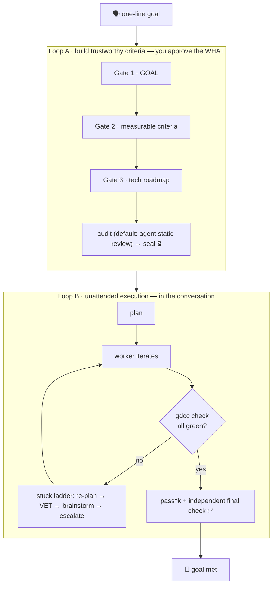

<div align="center">

# ◉ Goal-Driven for Claude Code

**Give it a one-line goal. Get a result that's actually met.**

A Claude Code plugin that turns coding into a **closed control loop**: you define the goal and verifiable criteria, a master agent supervises worker agents in a negative-feedback loop until the criteria *genuinely* pass — right in the conversation, no babysitting.

<br/>

[](./CHANGELOG.md)
[](./LICENSE)
[](https://docs.claude.com/en/docs/claude-code)
[](#-roadmap)
[](#-contributing)

<br/>

[**Quick start**](#-install) · [**Why**](#-what-it-solves) · [**How it works**](#-how-it-works) · [**Commands**](#-commands) · [**Config**](#️-configuration)

</div>

---

```text
you ▸  /goal-driven:go  implement an LRU cache in this repo that passes all unit tests

CC  ▸  ① co-design the goal / criteria / tech plan with you (the only step you're in)… ✅ sealed
       ② ▶ phase 1/2 core structure · worker iterating…
          gdcc check →  C1 [PASS]  C2 [FAIL]  C3 [FAIL]
       … runs unattended · brainstorms before it ever gives up · waits out quota limits …
       ③ ✅ GOAL VERIFICATION: ACHIEVED — criteria green twice in a row, wrapped up on its own
```

> **The key idea.** The criteria (`CRITERIA.sh`) are the **sensor** of the loop. If the sensor is wrong, stronger feedback just converges more confidently on the wrong thing. So Goal-Driven spends its effort where it matters most — **co-designing the criteria with you, then auditing them objectively** — instead of "asking another LLM if it looks fine."

<br/>

## ✨ Why use it

|  |  |
|---|---|
| 🎯 **One line → verifiable criteria** | You approve only the **WHAT** — a plain-language, measurable acceptance table. The machine writes and audits the **HOW** (the bash). You never review scripts. |
| 🔁 **Unattended, in the conversation** | The main agent becomes the master: dispatches workers, runs the criteria, keeps going on failure. **No terminal**, and a Stop-gate won't let it quit early. |
| 🛡️ **Reward-hacking resistant** | Before sealing, the criteria must reject empty *and* cheating solutions. Sealing locks a checksum, so a worker can't quietly move the goalposts mid-run. |
| 🧠 **Doesn't give up** | At a dead-end it first has `goal-decider` critically vet the "stuck" claim, then `goal-brainstormer` (fable 5) generates fresh approaches — it escalates to you only once creative options run dry. |
| 🔋 **Quota-aware** | Reads claude-hud usage: downgrades the model when high, waits out the window at the ceiling — all in-conversation. |
| 🧩 **Standard plugin** | One command to install. 6 slash commands, 9 specialized sub-agents, zero config. |

<br/>

## 🚀 Install

> Requires [Claude Code](https://docs.claude.com/en/docs/claude-code). In Claude Code, run:

```bash
/plugin marketplace add lqzzy/goal-driven-cc
/plugin install goal-driven@goal-driven-cc
```

Ready to use — no extra setup.

<br/>

## 🧭 Quick start

**The easy path** — describe a goal, answer a few questions, then walk away:

```bash
/goal-driven:go refactor src/parser until every test in tests/ passes with no lint errors
```

Prefer step-by-step control? Split it in two:

```bash
/goal-driven:new  <goal>   # co-design goal / criteria / tech plan with you → seal (stops for you to launch)
/goal-driven:run           # drive it unattended until the criteria are genuinely green
```

<br/>

## 🎯 What it solves

Typical agent loops have two chronic problems:

1. **They need babysitting** — you keep coming back to confirm and click *continue*.
2. **They reward-hack** — to "make the tests green" they may hardcode, weaken checks, or game the goal.

**Goal-Driven** treats coding as a **closed-loop control system**:

- **Criteria = sensor** — objectively measure *"is the goal met?"*
- **Master (the main agent) = controller** — reads the error, dispatches work, never stops early.
- **Worker (sub-agent) = actuator** — reads what's failing, makes the smallest real change.

Your one job: **get the goal and criteria right up front, together with it.** After that the loop converges on its own — that's what *goal-driven* means.

<br/>

## 🔁 How it works

Two nested loops: **Loop A** turns the goal into trustworthy criteria (co-designed with you); **Loop B** drives to all-green (unattended).



**The stuck ladder** — it gets creative before giving up; escalating to you is the *last* rung:

```text
worker keeps failing
  → re-plan             cheap; clears most stalls
  → goal-decider · VET  fable, skeptical: is it really stuck? any missed contradiction / angle?
  → goal-brainstormer   fable, divergent: invert the assumption · cross-domain analogy · change the axis…
  → ideas run dry → gdcc escalate → over to you, with "everything creative we tried" attached
```

<br/>

## 🧩 Commands

| Command | What it does |
|---|---|
| `/goal-driven:go <goal>` | **One shot**: co-design criteria → seal → run to completion, unattended. The daily driver. |
| `/goal-driven:new <goal>` | Co-design and seal the criteria only, then stop for you to launch. |
| `/goal-driven:run` | Drive a sealed task unattended until every criterion is green. |
| `/goal-driven:revise` | Re-define the goal / criteria / plan grounded in current progress (old version archived). |
| `/goal-driven:brainstorm` | Manually inject creativity into a stuck task. |
| `/goal-driven:status` | Progress, criteria scoreboard, seal & quota status. |

<br/>

## 🛡️ Design principles

- **You own the WHAT; the machine writes and audits the HOW.** You judge the goal, the measurable acceptance conditions, and the high-level route — all in plain language. The `CRITERIA.sh` / tests / baselines are written and checked by the machine. A clean split: **you verify "criteria = my intent"; the machine verifies "the script correctly measures the criteria."**
- **The audit is an objective fact, not another LLM's opinion.** Mutation-style mechanical audits (`lite` / `full`) actually feed empty and cheating solutions to the criteria; the default `agent` level has a read-only sub-agent reason about the same thing statically — fast, no heavy execution.
- **Sealing stops goalpost-moving.** Sealing just locks a criteria checksum (instant). While armed the guard blocks edits, and the checksum catches the one gap it can't — a worker rewriting the criteria through Bash.
- **It never silently relaxes the goal.** An agent can't change the criteria on its own. To change them you go through `revise` (human-authorized, archived, auditable), or — at a true dead-end — it escalates to you after a fable review.

<br/>

## ⚙️ Configuration

Per task, in `.goal-driven/config.env` (sensible defaults — you rarely touch these):

| Variable | Default | What it does |
|---|---|---|
| `GDCC_AUDIT_LEVEL` | `agent` | Criteria audit: `agent` (sub-agent static review, fastest) · `lite` (execute empty + cheat baselines) · `full` · `off`. |
| `GDCC_CONSECUTIVE_PASSES` | `2` | Criteria must pass this many times in a row to count as met (pass^k, beats a lucky pass). |
| `GDCC_QUOTA_PAUSE_AT` | `90` | 5h-usage % at which the run pauses and waits for the window to reset (headroom for in-flight calls). |
| `GDCC_QUOTA_DOWNGRADE_AT` | `80` | Usage % at which the worker drops to a cheaper model. |
| `GDCC_BRAINSTORM_ROUNDS` | `3` | Auto-brainstorm rounds at a dead-end before escalating to you. |
| `GDCC_MODEL_*` | — | Per-role models: fable only for planner / decider / brainstormer; everyone else caps at opus, floors at sonnet, never haiku. |

<br/>

## ❓ FAQ

<details>
<summary><b>Will it cheat just to turn the criteria green?</b></summary>
<br/>
That's the whole point of the project. Before sealing, the criteria are checked for their ability to tell right from wrong — <b>an empty solution and a cheating solution must both be rejected</b>, or it won't seal. After sealing, the checksum is locked, so a worker rewriting the criteria mid-run is caught and halts the loop. You own whether the criteria match your intent; the machine owns whether the criteria script is gameable.
</details>

<details>
<summary><b>Will it run forever and burn all my quota?</b></summary>
<br/>
No runaway. It reads claude-hud's usage cache: downgrades the model when high, and at the pause threshold (default 90%) waits in the background for the window to reset before resuming — all in the conversation. Usage data refreshes ~every 5 minutes (API limit), so the strategy is <i>headroom</i>, not pinpoint timing.
</details>

<details>
<summary><b>What if the goal really can't be reached?</b></summary>
<br/>
It won't give up at the first setback, and it won't quietly relax the goal. At a dead-end, fable first critically vets the "stuck" claim (often finding a missed angle to keep going), then fable brainstorms novel approaches; <b>only once ideas are exhausted</b> does it <code>gdcc escalate</code> — handing you a full analysis to decide on.
</details>

<details>
<summary><b>Do I need a terminal open the whole time?</b></summary>
<br/>
No terminal. The entire loop runs inside the Claude Code conversation (the main agent spawns Task sub-agents). Just keep the session open; for long unattended runs, <code>/clear</code> first or start a clean session with <code>claude --disallowedTools AskUserQuestion</code>.
</details>

<br/>

## 🗺️ Roadmap

Goal-Driven is **alpha** — the core loop works today. Where it's headed:

**Next**
- 📚 **Criteria presets** — starter templates for common goals (tests-pass, perf budget, safe refactor, API contract) so you jump straight to review.
- 🧵 **Parallel goals** — run and supervise several sealed goals at once.
- 💾 **Resumable runs** — checkpoint a run and pick it up in a fresh session.

**Exploring**
- 📊 A live run dashboard — phases, scoreboard, token spend at a glance.
- 🤖 CI mode — drive a goal to green as a GitHub Action.
- 🔬 Self-mutation testing of the code under test, not just the criteria.

Driving a goal we don't cover yet? [Open an issue](../../issues) — the roadmap follows what people actually build.

<br/>

## 🤝 Contributing

Issues and PRs welcome. Include how you verified your change; for criteria / audit changes, add adversarial baselines where you can.

## 📄 License

[MIT](./LICENSE) © Qi Li

<div align="center"><sub>Control theory, turning goals into results.</sub></div>
